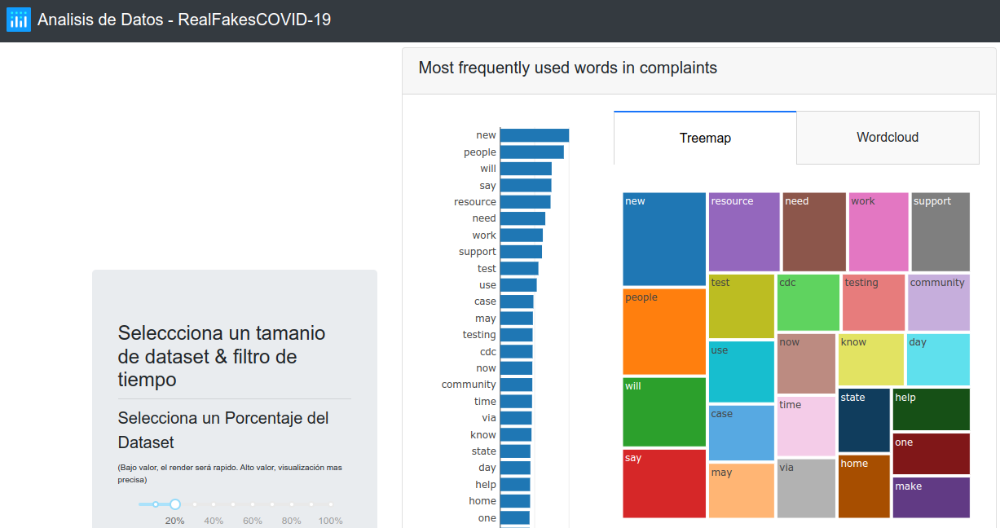
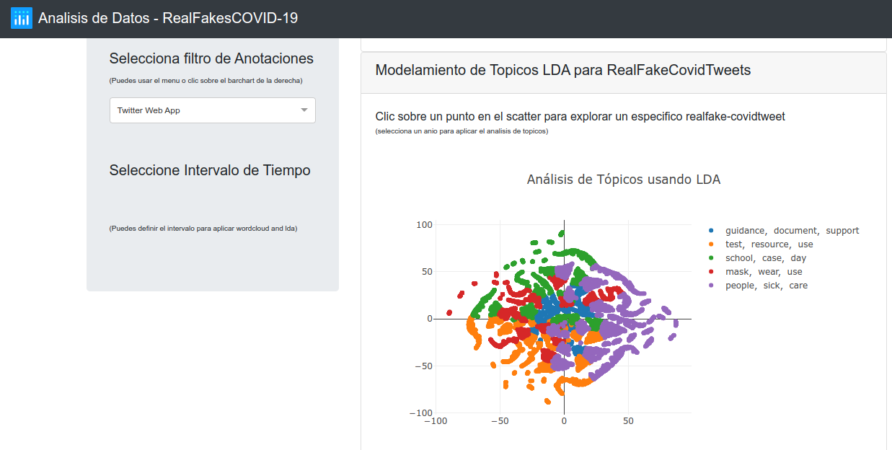

## Herramienta de Visualización aplicado a Tweets de Covid-19

La siguiente herramienta permite aplicar un análisis inicial para proporcionar una ayuda visual usando como dataset los tweets relacionados a temas del Covid-19, aplicando analisis de sentimientos y analisis de anotaciones, ejemplos de las visualizaciones se dan en las siguientes figuras:

<p align="center">
    
</p>

<p align="center">
    
</p>

Se tomó como base la libreria Dash y Plotly usando como ejemplo demo la parte de NLP dado en su [repositorio de demos](https://github.com/plotly/dash-sample-apps/tree/main/apps/dash-nlp) que fue realizado por @lundstrj @merenlin @ycaokris @nicolaskruchten @jbampton @xhlulu

### Dataset
El dataset CoAID ("Covid-19 heAlthcare mIsinformation Dataset") fue construido por Limeng Cui y -Dongwon Lee quienes recolectaron una base de 4521 noticias y 296000 afirmaciones de grupos sociales (claims) de 926 fuentes sociales recolectadas desde el anio 2019 diciembre y todo el anio 2020 en la cual se produjo la pandemia, esto puede ser obtenido desde su repositorio [CoAID](https://github.com/cuilimeng/CoAID).

Debido a las politicas de Twitter solo se comparten los ids de los diferentes tweets, por ello se realizó una hidratacion a cada lista de tweets y anotarlos de acuerdo a su categoria las cuales son entre FAKE o REAL dado para tweets con mensaje no real y con mensajes creibles respectivamente

De esta obtención se recolecto 78366 tweets 76042 tweets reales y 2278 twees fake, los cuales son proporcionados en el directorio de dataset_covid19_coaid

Analizando las fechas de cada mes se dan los siguientes frecuencias, observandose una considerable cantidad en los meses de mayo y abril del anio 2020 en donde se confirmaron los primeros casos de COVID-19 y las tasas de pacientes aumentaron.

| Grupos por Mes | Nro de Tweets | Min Fecha                | Max Fecha                |
|----------------|---------------|--------------------------|--------------------------|
| grupo 1        | 216           | min: 2019-12-01 00:09:31 | max: 2019-12-30 21:31:43 |
| grupo 2        | 856           | min: 2020-01-01 03:34:54 | max: 2020-01-31 23:21:12 |
| grupo 3        | 1420          | min: 2020-02-01 00:40:12 | max: 2020-02-29 23:56:44 |
| grupo 4        | 10974         | min: 2020-03-01 00:46:03 | max: 2020-03-31 23:47:12 |
| grupo 5        | 21945         | min: 2020-04-01 00:00:39 | max: 2020-04-30 23:59:14 |
| grupo 6        | 18674         | min: 2020-05-01 00:00:00 | max: 2020-05-31 23:58:23 |
| grupo 7        | 16258         | min: 2020-06-01 00:00:45 | max: 2020-06-30 23:59:48 |
| grupo 8        | 7679          | min: 2020-07-01 00:00:00 | max: 2020-07-31 19:17:20 |
| grupo 9        | 139           | min: 2020-08-01 02:46:41 | max: 2020-08-31 17:02:21 |
| grupo 10       | 30            | min: 2020-09-03 04:27:27 | max: 2020-09-29 08:43:05 |
| grupo 11       | 136           | min: 2020-10-01 08:13:26 | max: 2020-10-31 19:50:19 |

Usando como filtro inicial y para reducir el analisis de LDA se usó la fuente dando las siguientes frecuencias para los 20 primeros

| Fuente de Tweet       | Nro de Tweets |
|-----------------------|---------------|
| Twitter Web App       | 22541         |
| Twitter for iPhone    | 15940         |
| Twitter for Android   | 10988         |
| Hootsuite Inc.        | 4240          |
| Twitter Web Client    | 3726          |
| TweetDeck             | 2716          |
| Twitter for iPad      | 2011          |
| dlvr.it               | 1635          |
| IFTTT                 | 1377          |
| Buffer                | 1304          |
| Sprout Social         | 1088          |
| WordPress.com         | 1008          |
| Instagram             | 811           |
| Google                | 357           |
| HubSpot               | 353           |
| FS Poster             | 340           |


Estos datos tuvieron una limpieza respectiva con diferentes criterios para tomar solo
los datos escenciales de un tweet entre ellos son:

- remover urls extranias con vinculos sin http
- remover amps dados por conversion del signo ampersand
- remover menciones de usuario que comienzen con @
- remover urls standard con inicio de http o https
- remover hashtags comenzando con el caracter #
- remover urls de twitter que comienzan con pic.twitter\
- remover emoticones y emojis con codigos unicode
- remover emojis en formato string 
- remover simbolos extranios no esten dentro del alfabeto
- lematizar y remover stopwords y signos de punctuacion
- remover numeros
- remover muchos espacios en blanco
- remover palabras menos de dos caracteres

Todo esto puede ser reconstruido usando archivos proporcionados por Social Media Mining Toolkit [SMMT](https://github.com/thepanacealab/SMMT), el cual se uso para la adquisición y preprocesamiento de los tweets y que adaptados para el caso del dataset CoAID.

Los archivos finales deben ser descomprimidos uno es relacionado al propio dataset llamado consolidado.tar.gz y el otro es el precomputado.tar.gz basado en el dataset para el componente de  analisis de topicos.


### Herramienta de Visualización

#### Plots Principales

Esta visualizacion cuenta con 4 plots principales entre ellos son:

Existe una visualizacion en base a las frecuencias aplicada a cada tweet del corpus, obteniendo las 25 primeras frecuencias entre ellas son:

- Grafico de Frecuencias en barras
- Mapa de Jerarquia
- Nube de Palabras
- Análisis de Topicos:

    - Mapa TSNE-LDA

      Es un grafico para el analis de topicos donde es obtenido a partir de las frecuencias obteniendo las probabilidades de los diferentes tweets para cada topico emergente y cada topico cuenta con las 3 primeras keywords principales. El Tsne es aplicado posteriormente al LDA para visualizar en 2 dimensiones y conseguir los posiciones de cada tweets con su nro de documento y el nro de topico al cual pertences, dado un grafico tipo scatter

    - Tabla de resumen para el Mapa TSNE-LDA

      Adicionalmente existe una tabla donde se interactua cada vez que se selecciona un tweet en particular del mapa TSNE-LDA, asi se observa sus propiedades de probabilidad y keywords principales para el topico abordado del tweet seleccionado.


#### Filtros Aplicados

Existen 3 filtros principales entre ellos:

1. **Filtro de Muestreo:** Es el primero filtro que ayuda a reducir la carga del dataset
sobre los plots, a una muestra pequenia la visualizacion será rapida a una muestra grande hay mayor precision pero ralentiza la visualizacion

2. **Filtro de Anotacion:** Para esto se escogió un campo del dataset, en este caso
se uso la fuente de datos, el cual ayuda a aplicar el LDA sobre grupos mas pequenios y evitando tambien grupos con pocos datos. Se debe seleccionar alguno de ellos

3. **Filtro de Tiempo:** esto se aplica al anio 2019 y 2020 por el momento está el anio 2020
separado en los diferentes meses con cuartiles el cual obtendrá un intervalo de tiempo mínimo y máxima fecha para reducir el grupo a una cantidad menor de datos.

 
**TODO:** como una actividad posterior es cambiar el filtro de tiempo como principal entrada y el filtro de anotacion como un filtro secundario asi se evita perder data y contar con todos los meses para cuando se realice el segundo filtro.

#### Replicación

#### Replicar un archivo del CoAID 

En caso desees aplicar a otro dataset diferente primero debes conseguir credenciales de twitter en modo extended, el cual requiere llenar y responder ciertos formularios que twitter te pedirá por correo registrado a tu cuenta developer

Luego puedes obtener tus credenciales cuatro en total que deberás generar:
1. consumer_key
2. consumer_secret_key
3. access_token_key
4. access_token_secret_key

Mediante esto podras crear un archivo json con tus credenciales usando el comando 

```python3 create_file_credentials.py```

Aplica el archivo <code>get_metadata.py</code> para extraer tweets y asignes una etiqueta por ejemplo fake o real mediante este comando

<code>python3 get_metadata.py -i ClaimRealCOVID-19_tweets_ids.csv -o hydrated_tweets -k api_keys.json -c tweet_id -m extended -l real</code>
- con los parametro -i para el archivo de ingreso de ids de tweets
- con el parametro -o para el archivo de salida
- con el parametro k para el archivo de credenciales
- con el parametro -c para la columna que tiene el tweet
- con el parametro -m para el modo extendido que posees para tus credenciales
- con el parametro -l para etiquetar tus datos


Luego puedes realizar una limpieza mediante el archivo clean_tweets.py mediante el comando

<code>python3 clean_tweets.py hydrated_tweets.csv p</code>

Donde debes insertar como parametro el archivo hidratado final de los tweets con el parametro p para preprocesar los datos, con esto procesarás solo el archivo con ids de los tweets que has insertado, a mayor numero de datos mayor procesamiento, por ello se recomienda realizarlo por partes (grupos de pocos meses)


#### Lanzar la aplicación de visualización

1. Primero descomprime los archivos del dataset mencionados anteriormente

2. Crea un entorno virtual mediante

```ptyhon3 -m venv mientorno```

3. Activa este entorno para instalar las librerias, esto evitará que genere conflictos con otras librerias que poseas

<code>source mientorno/bin/activate</code>


4. Enfocado al lanzamiento de la visualizacion, se necesita librerias relacionadas a Dash y Plotly, para ello usa el archivo de requirements.txt mediante el comando

<code>pip install -r requirements.txt</code>

5. Luego ejecuta el app.py ubicado en el directorio source mediante el comando, se lanzará un host local con la app visitando la url http://127.0.0.1:8050

<code>python3 app.py</code>

Con esto tendrás replicado la herramienta de visualización 🎉🎉🎉

 
     


